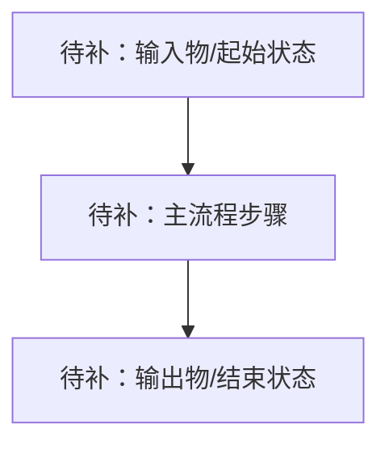
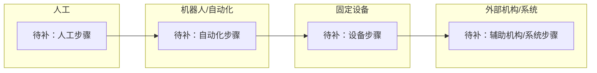
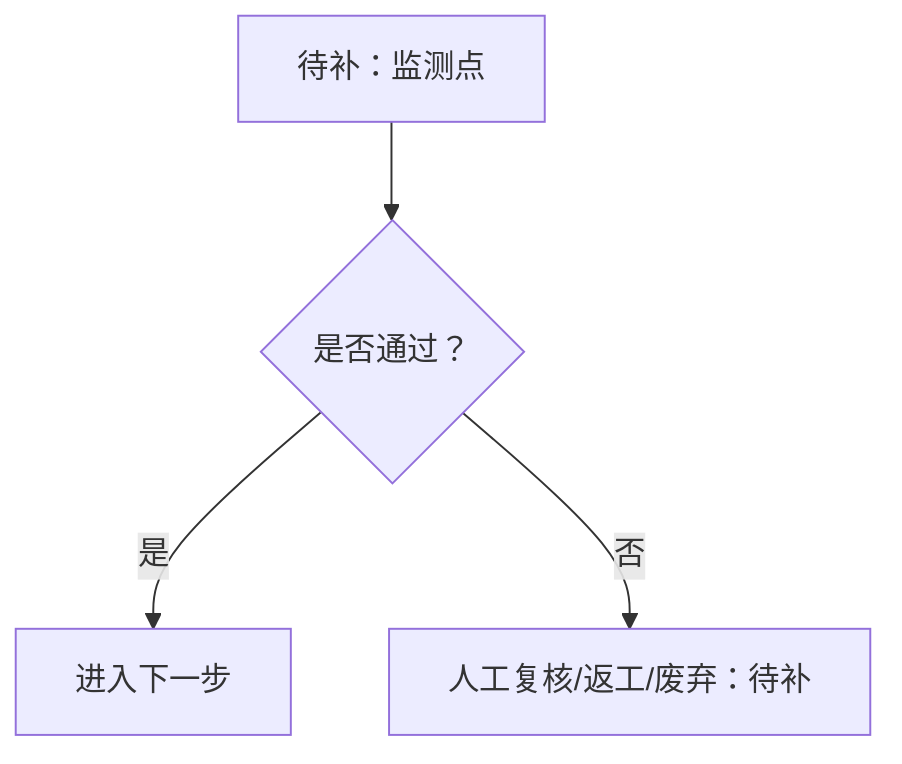
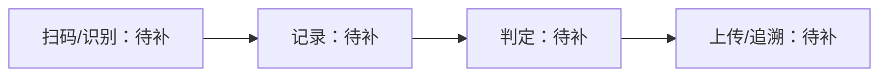

# 方案选项

## 输入摘要

## 方案成熟度

| 当前等级 | 判断依据 | 下一等级 | 升级所需资料 |
| --- | --- | --- | --- |
| S0/S1/S2/S3/S4 | 待补 | 待补 | 待补 |

## 当前资料缺口

## 方案 1: <名称>

## 方案 2: <名称>

## 方案 3: <名称>

## 总流程图

## 泳道流程图

## 异常流程图

## 数据流图

## 工艺步骤评分表

| Step ID | 工艺步骤 | 操作主体 | 操作对象 | 外部机构/系统 | 风险点 | 可行性 | 风险等级 | 资料置信度 | 自动化优先级 | 备注 |
| --- | --- | --- | --- | --- | --- | --- | --- | --- | --- | --- |

## 方案级评分矩阵

| 方案 | 工艺完整性 | 自动化收益 | 风险可控性 | 实施复杂度 | 资料置信度 | 验证清晰度 | 推荐结论 |
| --- | --- | --- | --- | --- | --- | --- | --- |

## 外部机构与接口清单

## 二维 HTML 三视图说明

目标文件：`outputs/process_view.html`

- 流程泳道视图：
- 空间/工位二维布局视图：
- 步骤详情侧栏视图：

## 对比矩阵

## 推荐方向

## 暂不建议自动化的步骤

## 被否决方案

## 假设锁定与变更记录

| 假设 ID | 假设内容 | 来源 | 影响范围 | 被哪些方案/步骤引用 | 确认状态 |
| --- | --- | --- | --- | --- | --- |

## 评审会议输出包

### 本轮结论
### 推荐方案
### 不推荐方案
### 关键风险
### 待客户/现场确认事项
### 下一轮资料清单
### 工程待办

## 开放问题

## Action Packages

### Action Package: <任务名>
- Goal:
- Input materials:
- Execution steps:
- Required files:
- Required tools:
- Deliverables:
- Acceptance criteria:
- Risks:
- Owner:
- Due date:
- Status:
